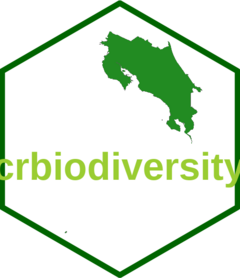

<!-- README.md is generated from README.Rmd. Please edit that file -->

# crbiodiversity 

<!-- badges: start -->
<!-- badges: end -->

The goal of crbiodiversity is to searching and retrieving biodiversity
data of Costa Rica

## Installation

You can install the development version of **crbiodiversity** like so:

``` r
# install.packages("devtools")
devtools::install_github("ManuelSpinola/crbiodiversity")
```

Also you need to install the following packages:

``` r
# install.packages("devtools")
devtools::install_github("ManuelSpinola/crgeo")
```

``` r
# install.packages("devtools")
devtools::install_github("ManuelSpinola/crgrids")
```

## Example

This is a basic example how to use the package:

``` r
library(tidyverse)
library(spocc)
library(sf)
library(crgeo)
library(crgrids)
library(crbiodiversity)
```

``` r
loc <- get_locations("Agalychnis callidryas")
#> 2 
#> 3
```

``` r
head(loc)
#> # A tibble: 6 × 6
#>   name                               longitude  latitude  prov  date       key  
#>   <chr>                              <chr>      <chr>     <chr> <date>     <chr>
#> 1 Agalychnis callidryas (Cope, 1862) -83.950451 10.325009 gbif  2023-01-02 4011…
#> 2 Agalychnis callidryas (Cope, 1862) -83.953133 10.33412  gbif  2023-01-03 4011…
#> 3 Agalychnis callidryas (Cope, 1862) -84.06818  10.4503   gbif  2023-01-03 4014…
#> 4 Agalychnis callidryas (Cope, 1862) -84.068276 10.450406 gbif  2023-01-03 4014…
#> 5 Agalychnis callidryas (Cope, 1862) -84.978972 10.707888 gbif  2023-01-07 4067…
#> 6 Agalychnis callidryas (Cope, 1862) -84.708118 10.438699 gbif  2023-01-07 4014…
```

``` r
get_map("Agalychnis callidryas")
#> 2 
#> 3
#> Warning: attribute variables are assumed to be spatially constant throughout
#> all geometries
```


